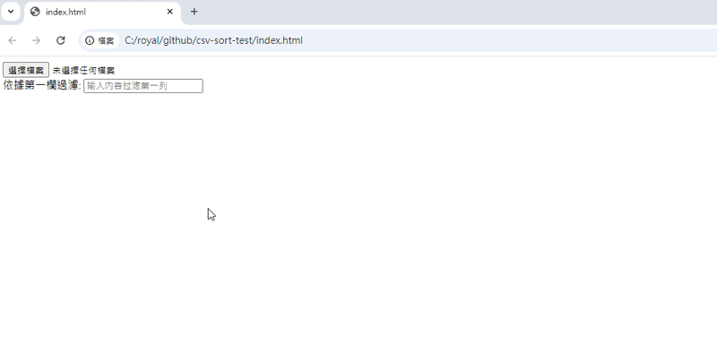

# csv-sort-test
外部匯入一個 CSV 檔案並在介面中排序資料內容的順序

# 操作簡介
1. 提供一個 `EventNews.csv` 的範例檔案  
2. 左上按鈕可以開啟 `EventNews.csv` 檔案  
3. 第二列可以過濾想要看到的 `LanguageID`  
4. 點擊第一列欄位，可以依據該欄位做正反排序  
5. 滑鼠點擊過後，會標示為`淺黃色`  
6. `淺黃色`列在按下上下鍵，會對上或下的列做交換位置  

# 操作預覽


# 升級到 Vue 3 的注意事項
在升級到 Vue 3 後，過濾行的邏輯已更新為使用嚴格相等比較 (`===`) 來過濾行。這樣當你輸入 "2" 時，只會顯示第一欄為 "2" 的行，而不會顯示包含 "2" 的行。具體實現如下：

```javascript
filterRows() {
  this.filteredRows = this.rows.filter(row => row[0] === this.filterText);
}
```

# 程式碼流程與規則(script.js)
1. handleFileUpload: 處理文件上傳，使用 PapaParse 解析 CSV 文件。
2. parseCSV: 解析 CSV 數據，將第一行作為標題，其餘行作為數據行，並提取第一欄的唯一值作為過濾選項。
3. filterRows: 根據 filterText 過濾行，只顯示第一欄完全匹配的行。如果 filterText 為空，顯示所有行。
4. sortColumn: 根據點擊的列進行排序，支持正反排序。
5. onDragStart: 拖動開始的處理函數。
6. onDragEnd: 拖動結束的處理函數。
7. onDragChange: 拖動改變的處理函數。
8. onRowFocus: 當行獲得焦點時，更新 selectedIndex。
9. onArrowDown: 當按下向下箭頭時，交換當前行與下一行的位置。
10. onArrowUp: 當按下向上箭頭時，交換當前行與上一行的位置。
11. swapRows: 交換 filteredRows 和 rows 中的行。

# 程式碼流程與規則 (index.html)
1. 文件上傳按鈕: 用於上傳 CSV 文件。
2. 過濾選單: 根據 CSV 文件的第一欄生成選項，選擇後過濾顯示的行。
3. 表格: 動態生成表頭和表格行，支持點擊表頭排序和拖動排序。
4. 引入外部庫: 包括 Vue 3、Sortable.js、vuedraggable 和 PapaParse。
5. 引入自定義腳本: 包含應用的主要邏輯。
